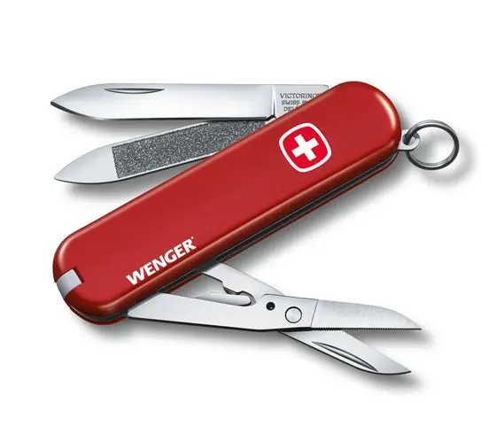

# Wenger

Wenger is an asynchronous Rust networking "Swiss Army Knife" that makes it easy to build protocols, application clients, and application servers.

It's like [Wangle](https://github.com/facebook/wangle/), but in Rust.
